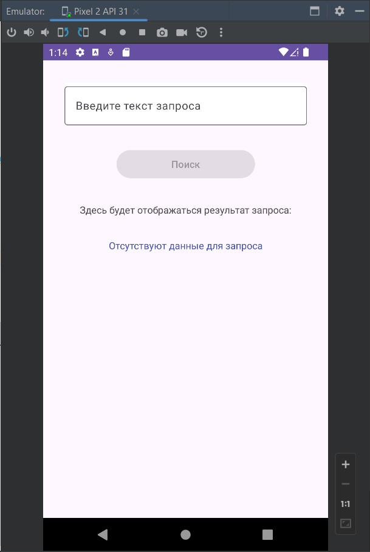
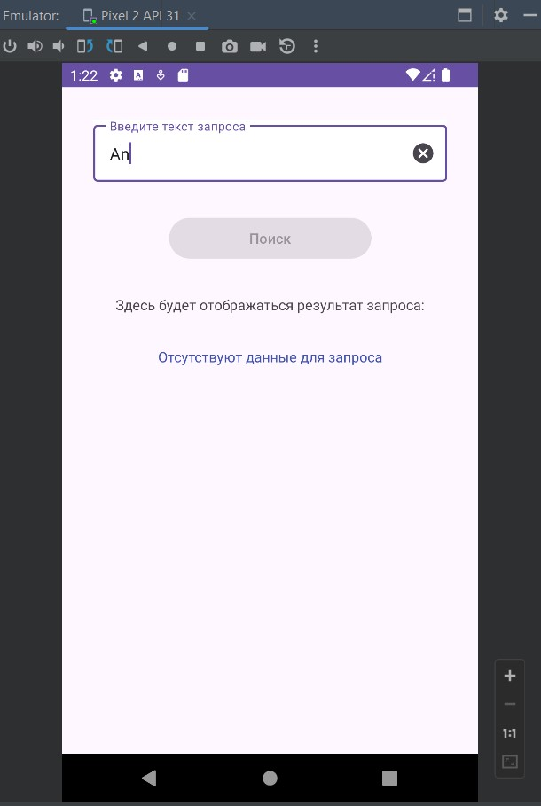
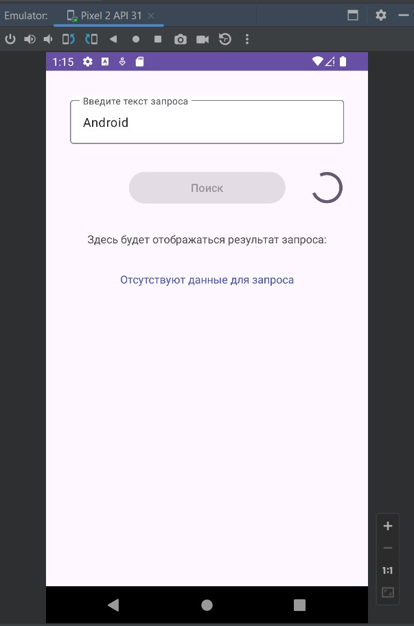
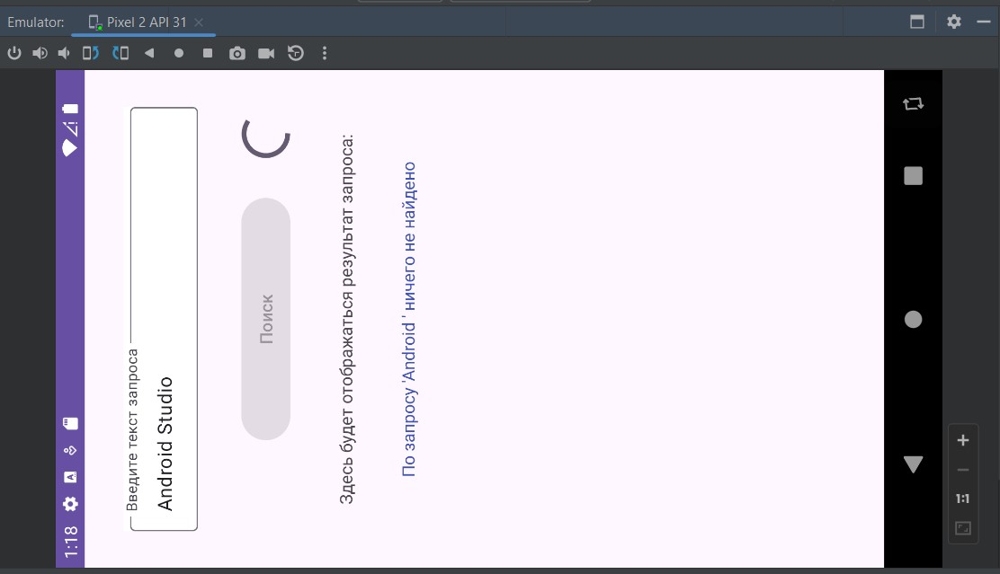

# Урок 12. Архитектура презентационного слоя

Цели практической работы
Применить знания по архитектуре MVVM, отработать сохранение и изменение состояния 
экрана через ViewModel.

Что нужно сделать
Создайте экран поиска:
1. Сверстайте экран, на котором будет поисковая строка, кнопка поиска и TextView 
с текстом «Здесь будет отображаться результат запроса» или с любым другим на ваше усмотрение.
2. Сделайте так, чтобы кнопка поиска была заблокирована, если в поисковой строке меньше
 трёх символов или идёт поиск.
3. Задайте, чтобы после ввода текста и нажатия на поиск отображался прогресс.
4. Сымитируйте процесс выполнения запроса с помощью корутин и функции delay, как было показано в видеоматериале.
5. Убедитесь, что после того, как поиск завершён, прогресс исчезает и отображается текст 
«По запросу <текст запроса> ничего не найдено».

================================================================================

## Демонстрация решения:

